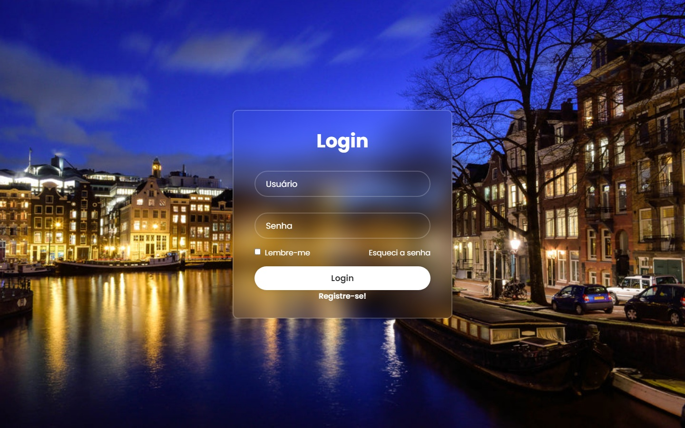

<h1 align="center"> Página de Login </h1>

Página feita com base em outro projeto para busca de referências

 

## Tecnologias

Esse projeto foi desenvolvido com as seguintes tecnologias:

- HTML
- CSS

## Projeto

Página de Login simples (sem funcionalidade real, apenas estética)

## Sobre
 
 Foi usado outro código semelhante para que eu pudesse desenvolver este projeto, porém com minhas preferências de estilo e imagem.

 ## Aprendizado

 Consegui ótimas noções de posicionamento de elementos e idéias de layout, cores e transparências.
